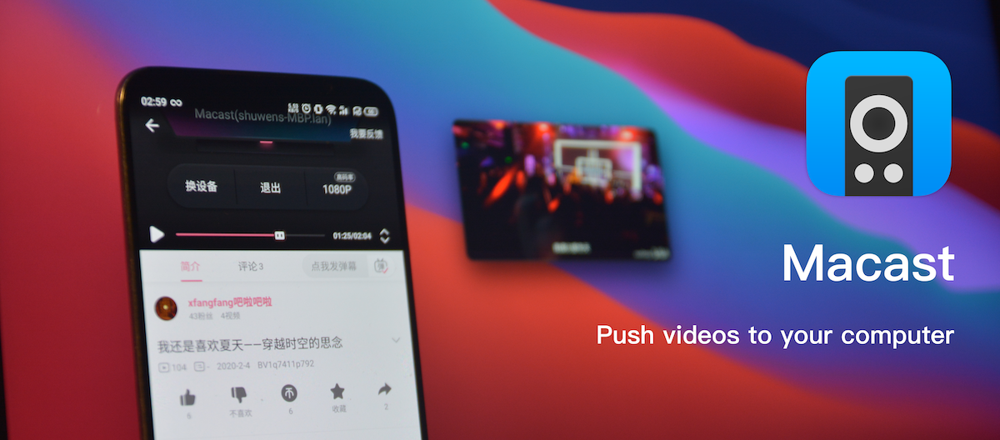

# Macast

[](https://github.com/xfangfang/Macast/releases/latest)
[](https://github.com/xfangfang/Macast)
[](https://github.com/pingod/Macast/tree/main/macast/plugins)
[](https://github.com/xfangfang/Macast/actions/workflows/build-macast.yaml)
[](https://github.com/xfangfang/Macast/releases/latest)
[](https://github.com/xfangfang/Macast/releases/latest)
[](https://github.com/xfangfang/Macast/releases/latest)

[README_EN](README.md)

Macast是一个跨平台的 **菜单栏\状态栏** 应用，用户可以使用电脑接收发送自手机的视频、图片和音乐，支持主流视频音乐软件和其他任何符合DLNA协议的投屏软件。


😂 **请尽量使用英语在Github交流，如果喜欢的话可以点个star关注后续更多协议支持的更新**

## 本分支（pingod/Macast）的新增内容

在 DLNA 之外，本分支把 Macast 做成了一个**多协议并发**的接收端，并把设置页做成了
可视化管理台：

- **Chromecast 接收端**：mDNS 广播 + Cast v2（TLS 8009 + setup HTTP 8008）。
  Chrome / VLC / Android 等发送端可直接投屏。未做 Google 设备认证，官方 SDK 发送端可能失败。
- **AirPlay 接收端**：mDNS + RTSP，支持视频 URL 投屏。音频(RAOP)与屏幕镜像未实现。
- **三协议并发**：DLNA / Chromecast / AirPlay 可同时在线、各自可被发现，互不干扰
  （`macast/protocol_group.py`）。
- **网卡选择**：设置页 → 状态 → 网络与广播。多网卡（虚拟机网桥 / VPN / Tailscale）时
  可显式指定广播网卡；不选则自动用承载默认路由的网卡。避免"能搜到但投不上"。
- **插件热插拔**：设置页 → 插件，可**启用 / 停用 / 卸载 / 安装**，全部**即时生效、无需重启**。
  卸载是可恢复的（文件移到配置目录 `.trash/<时间戳>/`）。
- **插件索引自持**：设置页「可安装」分组的数据源是本仓库的 [`plugins/info.json`](plugins/info.json)，
  不再读上游 `xfangfang/Macast-plugins`（它的 6 个插件现已全部内置，继续读只会产生重复卡片和
  指回上游旧文件的「可更新」角标）。地址只写在 `macast/plugin_repo.py` 一处，由 `/api?query=plugin-info`
  下发；浏览器按 `raw.githubusercontent.com` → `cdn.jsdelivr.net` 顺序回退，全都不通时只显示本机插件。
- **网页投屏入口**：`GET /api?query=cast&url=<绝对地址>&token=<令牌>`，给 iOS 快捷指令、
  书签、`curl`、脚本用，绕开 DLNA 发现也能投屏；`POST cast-uri` 继续服务设置页的重投。
  令牌是**常驻**的（存在 `macast_setting.json` 的 `Api_Token`），在「状态 → 网页投屏入口」
  里可一键复制；GET 版即使来自本机也要求令牌 —— 任意网页都能往 `127.0.0.1` 发 GET，
  不能让它们指使你的 Mac 播片。
- **播放状态如实上报**：Chromecast 的 `LOAD` 不再无脑回 `PLAYING`，而是等播放器确认；
  播放器报错则回 `LOAD_FAILED`。

**接手开发 / 排查问题请先读 [`AGENTS.md`](AGENTS.md)**（代码地图、踩坑清单、发版流程），
真机验证与历史问题复盘见 [`docs/Cast-AirPlay-Testing.md`](docs/Cast-AirPlay-Testing.md)。


## 安装

进入页面选择对应的操作系统下载即可，应用使用方法及截图见下方。

- ### MacOS || Windows || Debian

  下载地址1:  [Macast 最新正式版 github下载](https://github.com/xfangfang/Macast/releases/latest)

  下载地址2:  [Macast 最新正式版 gitee下载（上面访问无效可使用此备用链接）](https://gitee.com/xfangfang/Macast/releases/)

- ### 包管理
  你也可以使用包管理器安装macast  
  ```shell
  # 需要 python>=3.6
  pip install macast
  ```

  请查看我们的wiki页面获取更多的包管理相关信息（如：aur）: [Macast/wiki/Installation#package-manager](https://github.com/xfangfang/Macast/wiki/Installation#package-manager)  
  Linux用户使用包管理器安装时运行可能会有问题，建议替换如下两个库为我修改过的库（分别负责`菜单显示`与`文本复制`）：

  ```shell
  pip install git+https://github.com/xfangfang/pystray.git
  pip install git+https://github.com/xfangfang/pyperclip.git
  ```

  **Linux用户如果安装或运行有问题，可以查看 [这里](https://github.com/xfangfang/Macast/wiki/Installation#linux)**

- ### 从源码构建或运行

  构建请参阅: [Macast Development](docs/Development.md) 和 [build-macast.yaml](https://github.com/xfangfang/Macast/blob/main/.github/workflows/build-macast.yaml)
  
  运行只需要clone仓库，根据不同的操作系统于requirements文件中安装相关的包，并在项目根目录运行 `Macast.py` 即可。


## 使用方法

- **普通用户**  
  1. 打开应用后，**菜单栏 \ 状态栏 \ 任务栏** 会出现一个图标，这时你的设备就可以接收来自同一局域网的DLNA投放了。

- **进阶用户**  
  1. 以前要手动下载的插件（IINA、Web、Live、PotPlayer、PIFMRDS、NVA 协议）现在**都已内置**，
     在设置页 → 插件里直接启用 / 停用 / 卸载即可，即时生效、不用重启。
  2. 插件索引来自本仓库的 [plugins/](plugins/) 目录：目前可选装 **yt-dlp Downloader**
     —— 把投屏链接交给 `yt-dlp` 下载到本地而不是播放（B站 / YouTube / m3u8），
     需要你自己先装 `yt-dlp` 命令。设置页拉不到索引时只会显示本机插件，不影响使用。
  3. 支持修改默认播放器的快捷键或其他参数，见：[#how-to-set-personal-configurations-to-mpv](https://github.com/xfangfang/Macast/wiki/FAQ#how-to-set-personal-configurations-to-mpv)

- **程序员**  
  1. 可以依照教程完成自己的脚本，快速地适配到你喜欢的播放器，或者增加一些新的功能插件，比如：边下边看，自动复制视频链接等等。教程和一些示例代码在：[Macast/wiki/Custom-Renderer](https://github.com/xfangfang/Macast/wiki/Custom-Renderer)  
  2. 也可以参考内置的 [nirvana](macast/plugins/protocol/nirvana.py) 快速适配第三方魔改的DLNA协议。

内置插件放在 [macast/plugins/](macast/plugins/)；欢迎向 [pingod/Macast](https://github.com/pingod/Macast) 提 PR 或提 issue。  
**注意：不要轻易加载非官方仓库下载的插件，这里“插件”本身是可以运行在电脑上的任意代码，不建议加载非官方提供的插件。**


## 开发计划

- [x] 完成第一版应用，支持MacOS
- [x] 添加对Linux和Windows的支持
- [x] 完善协议，增强软件适配性
- [x] 统一MacOS与其他平台的UI
- [x] 添加多播放器支持
- [x] 添加多网卡支持
- [x] 添加自定义端口和自定义播放器名称
- [ ] 改进目前的播放器控制页面
- [x] 增加插件商店
- [x] 添加bilibili弹幕投屏
- [x] 增加 Chromecast 接收端协议（mDNS + Cast v2，URL 投屏，见 macast/protocol_cast.py）
- [x] 增加 AirPlay 接收端协议（mDNS + RTSP，视频 URL 投屏，见 macast/protocol_airplay.py）
- [x] 多协议并发：DLNA / Chromecast / AirPlay 可同时在线并各自可被发现（见 macast/protocol_group.py）
- [x] 网卡选择界面（设置页可指定用于发现/广播的网卡）
- [x] 插件热插拔：设置页启用 / 停用 / 卸载 / 安装，即时生效无需重启
- [x] 播放状态如实上报（Chromecast LOAD 等播放器确认后才回 PLAYING）
- [ ] AirPlay 屏幕镜像 / 音频(RAOP) 支持（需实时编码 / ALAC 解码，超出当前范围）
- [ ] 支持airplay 完整能力（当前为视频 URL 投屏子集）

## 出现问题的可能原因及解决办法（更详细内容见项目的wiki）

0. 应用闪退  
    大概率是由windows的hyper-v占用端口号导致的，建议修改hyper-v占用的端口号范围或修改本应用的启动端口号（[Macast配置文件位置](https://github.com/xfangfang/Macast/wiki/FAQ#where-is-the-configuration-file-located)）
2. 无法搜索到Macast——被电脑防火墙拦截  
    手机尝试访问 http://电脑ip:1068，如:192.168.1.123:1068 如果出现helloworld 等字样排除问题。  
    *具体端口号见应用菜单设置的第一项，如果没有则为默认的1068*
2. 无法搜索到Macast——路由器问题  
    路由器需要开启UPnP，关闭ap隔离，确认固件正常（部分openwrt有可能有问题）
4. 无法搜索到Macast——手机软件有问题  
    可以重启软件或更换软件尝试，或向其他投屏接收端电视测试
    尝试在搜索页面等待久一点（最多1分钟如果搜不到那应该就是别的问题了）
    如操作系统为IOS，注意要开启软件的**本地网络发现**权限
5. 无法搜索到Macast——网络问题  
    请确定手机和电脑处在同一网段下，比如说：电脑连接光猫的网线，手机连接路由器wifi，这种情况大概率是不在同一网段的，可以查看手机和电脑的ip前缀是否相同。
6. 无法搜索到Macast——其他未知问题  
    尝试在同一局域网手机投电视，如果可以正常投说明问题还是出在电脑端，继续检查电脑问题或查看如何报告bug

## 对于反馈问题的说明

  1. 先确保自己有认真读过使用说明
  2. 在提issue时，请及时地回复作者的消息，太多人提完问题或者反馈就消失，提之前先看别人问过没有，提之后积极参与讨论。如果您做不到回复issue，请不要随便提issue浪费开发者的时间。
  3. 遇到问题不要只说现象，请附带所有你认为能帮助开发者解决问题的信息，这会让开发者认为你很聪明，且极大的帮助加快解决你的问题与节省开发者的时间。
  4.  如果你遇到了某个问题，请优先考虑是自己没有看使用说明，比如我遇到过很多很多遭遇了投屏搜索不到的用户，直接评论说，“这个软件用不了”。用不了那是我编出来逗你玩的吗？检查一下自己的防火墙OK？
  5. 如果你不能自己去写，请不要提出那种很难实现的需求，开发者愿意解决的是：“我有个需求，讨论一下要怎么实现” 而不是 “可以帮我给这个软件加上***功能吗？”

## 如何报告bug
  准备以下信息，推荐到Github报告问题，点击 **[new issue](https://github.com/xfangfang/Macast/issues/new/choose)** 去反馈问题：
  1. 你的电脑系统类型和版本：如Win10 20h2
  2. 你使用的手机系统和软件：如 安卓 bilibili
  3. bug复现：如何复现bug与bug是否可以稳定复现
  4. 程序运行的log（复现问题时候的log）：  
    - windows下载debug版应用, 拖入cmd执行，复现问题后，关闭应用，ctrl-a全选复制：[download debug](https://github.com/xfangfang/Macast/releases/latest)  
    - mac 终端输入：`/Applications/Macast.app/Contents/MacOS/Macast` 回车运行，复现问题后，关闭应用，复制log  
    - linux 安装deb后，命令行运行 `macast` \\ 或直接从源码运行 \\ 或包管理安装后命令行运行 `macast-cli`，复现问题后，关闭应用，复制log  

## 用户反馈

点击链接加入群聊【小方的软件工地】：[983730955](https://jq.qq.com/?_wv=1027&k=4ioK8gQs)

当然也可以考虑捐赠 ~~获得贵宾售后服务（开玩笑）~~ 支持Macast和他的开发者们为了这个软件熬过的日日夜夜


## 使用截图
*如果系统设置为中文，Macast会自动切换中文界面*  

在投放视频或其他媒体文件后，可以点击应用图标复制媒体下载链接  


支持选择第三方播放器  


## 相关链接

[UPnP™ Device Architecture 1.1](http://upnp.org/specs/arch/UPnP-arch-DeviceArchitecture-v1.1.pdf)

[UPnP™ Resources](http://upnp.org/resources/upnpresources.zip)

[UPnP™ ContentDirectory:1 service](http://upnp.org/specs/av/UPnP-av-ContentDirectory-v1-Service.pdf)

[UPnP™ MediaRenderer:1 device](http://upnp.org/specs/av/UPnP-av-MediaRenderer-v1-Device.pdf)

[UPnP™ AVTransport:1 service](http://upnp.org/specs/av/UPnP-av-AVTransport-v1-Service.pdf)

[UPnP™ RenderingControl:1 service](http://upnp.org/specs/av/UPnP-av-RenderingControl-v1-Service.pdf)

[python-upnp-ssdp-example](https://github.com/ZeWaren/python-upnp-ssdp-example)
